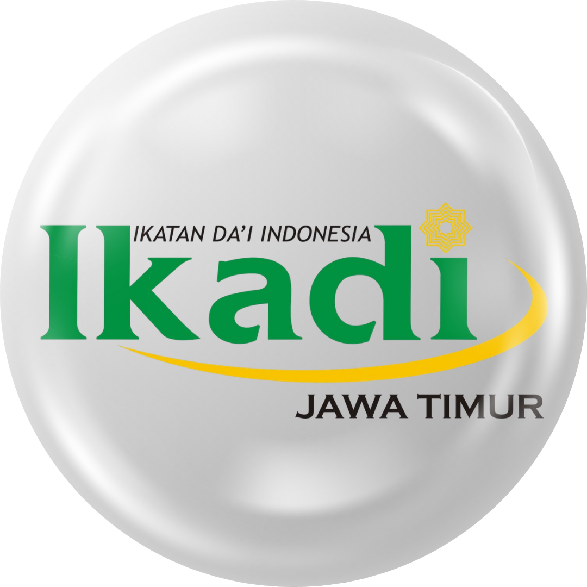

<div align="center">



# IKADI Jawa Timur Web Platform

### Modern Islamic Organization Platform with Integrated CMS, AI Infrastructure, and Enterprise Architecture

<p align="center">
  <a href="#">
    
  </a>
  <a href="#">
    
  </a>
  <a href="#">
    
  </a>
  <a href="#">
    
  </a>
</p>

<p align="center">
  
</p>

<p align="center">
  
  
  
  
  
  
</p>

<br />

> Fullstack web platform fully designed, architected, developed, deployed, and maintained by a solo developer.

</div>

---

# 📖 About The Project

IKADI Jawa Timur Web Platform adalah platform digital organisasi modern yang dibangun untuk mendukung operasional, publikasi, edukasi, dan sistem konsultasi berbasis web.

Project ini tidak hanya berupa company profile website, tetapi juga mencakup:

- Enterprise-style CMS Dashboard
- Consultation Workflow System
- AI-ready Infrastructure
- Content Management System
- Dynamic Event Management
- Role-Based Access Control
- Integrated Backend Services
- Scalable Frontend Architecture

Platform ini dirancang menggunakan pendekatan modern fullstack architecture dengan fokus pada:

- scalability
- maintainability
- modularity
- developer experience
- responsive user experience
- AI extensibility

---

# 🧠 System Overview

Platform terdiri dari dua sistem utama:

| System | Description |
|---|---|
| Public Website | Website publik untuk informasi organisasi, artikel, program, dan konsultasi |
| Admin CMS Dashboard | Dashboard internal untuk manajemen seluruh konten dan workflow |

---

# 🌐 Public Website Features

## 🏠 Landing Page
- Hero section
- Organization profile
- Dynamic statistics
- Featured programs
- Latest articles
- Event highlights
- Gallery showcase
- Collaboration section
- Footer navigation

## 📰 Article & News System
- Dynamic article listing
- Category filtering
- Rich article rendering
- SEO-friendly structure
- Detail article pages

## 📚 Program Management
- Program dakwah
- Kajian information
- Educational programs
- Consultation services
- Organization activities

## 🕌 Event & Kajian System
- Event listing
- Detail event page
- Schedule management
- Event information system

## 💬 Consultation Portal
- Online consultation form
- Consultation workflow
- Consultation detail page
- Moderation-ready structure

## 🎨 UI/UX Features
- Fully responsive layout
- Dark / light mode
- Mobile-first navigation
- Interactive animation
- Floating widgets
- Audio player
- Hijri calendar integration

---

# 🛠️ Admin Dashboard Features

## 🔐 Authentication & Authorization
- Login system
- Forgot password
- Reset password
- Protected routes
- Role-based access control (RBAC)

## 📰 Article Management
- Create article
- Edit article
- Delete article
- Category management
- Rich text editor integration

## 📅 Event Management
- Event CRUD
- Schedule management
- Event detail management

## 📚 Program Management
- Program CRUD
- Dynamic content management

## 💬 Consultation Moderation
- Consultation approval workflow
- Waiting & rejected status
- Consultation moderation system

## 👥 User Management
- User CRUD
- Role management
- Profile management

## 📢 Running Text Management
- Dynamic banner system
- Running text configuration

---

# 🚀 Tech Stack

## Frontend

| Technology | Purpose |
|---|---|
| React 18 | Frontend Framework |
| TypeScript | Type Safety |
| Vite | Build Tool |
| TailwindCSS | Styling |
| ShadCN UI | Component System |
| Radix UI | Accessible Components |
| Framer Motion | Animation |
| React Router DOM | Routing |
| React Hook Form | Form Handling |
| Zod | Validation |
| TanStack Query | Data Fetching |

---

## Backend & Services

| Technology | Purpose |
|---|---|
| Node.js | Runtime |
| Express.js | Backend Service |
| Supabase | Database & Authentication |
| WebSocket (ws) | Realtime Communication |
| OpenAI SDK | AI Integration |

---

## Editor & Content

| Technology | Purpose |
|---|---|
| TipTap Editor | Rich Text Editor |
| Markdown Support | Content Formatting |

---

# 🤖 AI Infrastructure

Project ini telah memiliki AI-ready architecture dan integrasi modern AI workflow.

## AI Features
- OpenAI SDK integration
- Retrieval-Augmented Generation (RAG)
- Vector synchronization workflow
- AI-assisted infrastructure
- Intelligent consultation preparation

## AI Architecture

```bash
server/
├── rag-service.ts
├── vector sync
├── AI workflow
└── OpenAI integration
```

Platform ini dipersiapkan untuk pengembangan:

- semantic search
- AI consultation assistant
- intelligent knowledge base
- recommendation system
- smart moderation workflow

---

# 🧱 Project Architecture

```bash
src/
├── assets/
├── auth/
├── components/
│   ├── admin/
│   └── ui/
├── data/
├── hooks/
├── pages/
│   ├── admin/
│   └── public/
├── services/
├── lib/
├── types/
└── utils/

server/
├── index.ts
├── rag-service.ts
└── websocket/
```

---

# ⚙️ Installation

## Clone Repository

```bash
git clone https://github.com/athallahnz/ikadi-jatim.git
cd ikadi-jatim
```

---

## Install Dependencies

```bash
npm install
```

---

## Environment Variables

Create `.env` file:

```env
VITE_SUPABASE_URL=
VITE_SUPABASE_ANON_KEY=
OPENAI_API_KEY=
```

---

## Run Frontend

```bash
npm run dev
```

---

## Run Backend Server

```bash
npm run server:dev
```

---

# 📦 Production Build

```bash
npm run build
```

---

# ☁️ Deployment

Project deployment configured using:

- Vercel
- Environment Variables
- Vite Production Build

Deployment configuration:

```bash
vercel.json
```

---

# 🔐 Security Features

- Protected Routes
- RBAC Authorization
- Authentication Context
- Environment Secret Isolation
- Secure Backend Workflow

---

# 🎨 UI Component Ecosystem

## Component Libraries
- ShadCN UI
- Radix UI
- TailwindCSS
- Framer Motion

## Reusable Components
- Modal
- Dialog
- Drawer
- Sidebar
- Table
- Tabs
- Tooltip
- Toast
- Accordion
- Carousel
- Rich Text Editor

---

# 👨‍💻 My Contributions

This entire project was independently developed by me as a **solo fullstack developer**.

I handled:

## 🧠 System Architecture
- Fullstack application architecture
- Folder structure design
- Data flow architecture
- Scalable modular structure

## 🎨 Frontend Engineering
- Responsive UI development
- Component architecture
- Animation system
- State management
- Routing system
- Theme system
- Mobile optimization

## ⚙️ Backend Engineering
- Express.js backend service
- Supabase integration
- Authentication workflow
- Authorization system
- Service abstraction layer
- WebSocket integration

## 🛠️ CMS Development
- Admin dashboard system
- Content management workflow
- Consultation moderation system
- Dynamic management panels

## 🤖 AI Engineering
- OpenAI integration
- RAG service development
- Vector synchronization workflow
- AI-assisted infrastructure

## ☁️ DevOps & Deployment
- Vercel deployment configuration
- Environment management
- Production optimization
- Build optimization

---

# 🌟 Technical Highlights

- Enterprise-style CMS Architecture
- AI-ready Infrastructure
- Modern React Ecosystem
- Full TypeScript Implementation
- Modular Scalable Structure
- Responsive User Experience
- Production-ready Deployment
- Solo Fullstack Development

---

# 🚀 Future Improvements

- Realtime notification system
- AI-powered recommendation system
- Semantic search engine
- Multi-role permission matrix
- Mobile application integration
- Analytics dashboard
- Intelligent moderation system

---

# 📄 License

This project is proprietary software developed for IKADI Jawa Timur.

Unauthorized distribution or reproduction is prohibited.

---

# ✨ Author

<div align="center">

## Developed with ❤️ by AnzArt Studio

### Fullstack Developer • System Architect • AI Integration Engineer

<p align="center">
  
</p>

</div>
